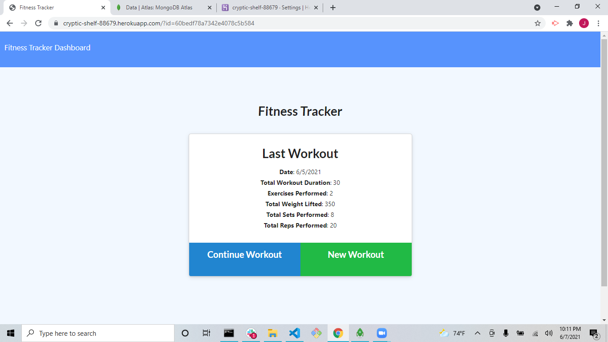

# workout-tracker

Given front end code created Mongo database to create a fitness tracker.
Created models and routes to make a functioning Mongo db application.
Application allows user to create and save fitness regimens as well as view workouts done over time.
Technologies used are express, mongoose, and morgan

https://cryptic-shelf-88679.herokuapp.com/

</img>
